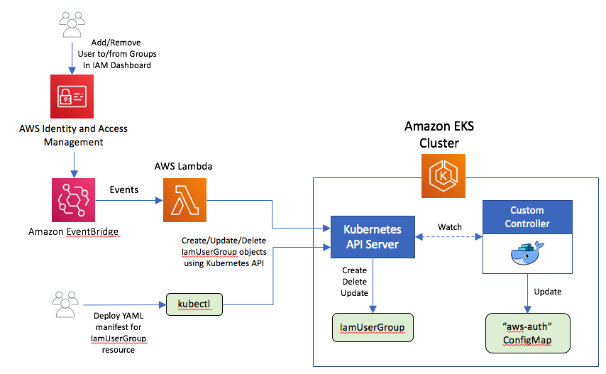

## Amazon EKS Operator for RBAC-IAM Integration

Kubernetes Operator that leverages new features in Kubernetes Java SDK to help manage the integration of Kubernetes role-based access control (<a href="https://kubernetes.io/docs/reference/access-authn-authz/rbac">RBAC</a>) and AWS Identity and Access Management (<a href="https://docs.aws.amazon.com/IAM/latest/UserGuide/introduction.html">IAM</a>) in a Kubernetes cluster provisioned using Amazon Elastic Kubernetes Service (<a href="https://docs.aws.amazon.com/eks/latest/userguide/what-is-eks.html">Amazon EKS</a>)

## Architecture
The architecture used to implement this automation of integration between Kubernetes RBAC and IAM comprises the following key elements.

<ul>
<li>An Operator implemented using Kubernetes Java SDK. This operator packages a custom resource named IamUserGroup defined by a CustomResourceDefinition, a custom controller implemented as a Deployment, which responds to events in the Kubernetes cluster pertaining to add/update/delete actions on the IamUserGroup custom resource, Role/RoleBinding resources that allow the custom controller to make changes to the aws-auth ConfigMap.</li>
<li>
A Kubernetes Java client implemented as an AWS Lambda function whose execution is triggered whenever an IAM user is added or removed from an IAM group. This is made possible using Amazon EventBridge, which is a serverless event bus service that makes it easy to deliver a stream of real-time data from the IAM service and route that data to targets such as AWS Lambda.</li>
<li>Role/RoleBinding resources that control the access granted to Kubernetes Subjects that an IAM group is mapped to.
</li>
</ul>

## Installation Instructions

First, build the Docker image for the custom controller per instructions <a href="https://github.com/aws-samples/k8s-rbac-iam-java-operator/blob/master/java-operator">here</a>.

Next, build and deploy the Lambda Kubernetes client per the instructions <a href="https://github.com/aws-samples/k8s-rbac-iam-java-operator/tree/master/lambda-client">here</a>.

Then, deploy the Kubernetes operator to an Amazon EKS cluster as follows: 
<b>kubectl apply -f operator.yaml</b>

The initial state of <b>aws-auth</b> ConfigMap in the cluster contains the mapping that allows worker nodes to join the Amazon EKS cluster. Modify this ConfigMap applying the YAML manifest <b>aws-auth-configmap.yaml</b>. 
<ul>
<li>Replace WORKER_NODE_ROLE_ARN with the ARN of the IAM role assigned to the worker nodes in the EKS cluster.</li>
<li> Replce LAMBDA_ROLE_ARN with the ARN of the IAM role mapped to a Kubernetes group in the EKS cluster which has permissions to manage <i>IamUserGroup</i> custom resources in the <i>kube-system</i> namespace.</li>.
</ul>

Create a Kubernetes Role and RoleBinding as follows: 
<b>kubectl apply -f rbac-lambda-clients.yaml</b>
This will create a mapping that associates clients with the <b>lambda-clients</b> Kubernetes group if they were authenticated using temporary credentials that belong to the role LAMBDA_ROLE_ARN.

## License

This library is licensed under the MIT-0 License. See the LICENSE file.

